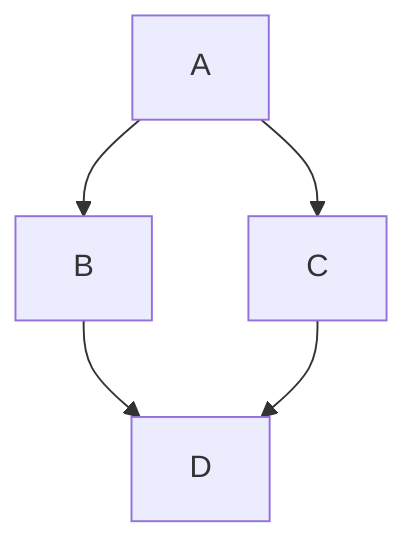

# GitHub Cheat Sheet

A collection of cool hidden and not so hidden features of Git and GitHub.

## Table of Contents

- [GitHub](#github)
  - [Ignore Whitespace in Diffs](#ignore-whitespace-in-diffs)
  - [Adjust Tab Space](#adjust-tab-space)
  - [Commit History by Author](#commit-history-by-author)
  - [Cloning a Repository](#cloning-a-repository)
  - [Branches](#branches)
    - [Compare Branches](#compare-branches)
    - [Compare Branches Across Forks](#compare-branches-across-forks)
    - [View Non-Merged Branches](#view-non-merged-branches)
  - [Gists](#gists)
  - [Git.io URL Shortener](#gitio-url-shortener)
  - [Keyboard Shortcuts](#keyboard-shortcuts)
  - [Line Highlighting](#line-highlighting)
  - [Closing Issues via Commit Messages](#closing-issues-via-commit-messages)
  - [Cross-Link Issues](#cross-link-issues)
  - [Locking Conversations](#locking-conversations)
  - [CI Status on Pull Requests](#ci-status-on-pull-requests)
  - [Filters for Issues and PRs](#filters-for-issues-and-prs)
  - [Syntax Highlighting in Markdown](#syntax-highlighting-in-markdown)
  - [Emojis](#emojis)
  - [Images and GIFs](#images-and-gifs)
  - [Quick Quoting](#quick-quoting)
  - [Paste Clipboard Images](#paste-clipboard-images)
  - [Quick Licensing](#quick-licensing)
  - [Task Lists](#task-lists)
  - [Relative Links](#relative-links)
  - [Rendering CSV/TSV Files](#rendering-csvtsv-files)
  - [Rendering PDFs](#rendering-pdfs)
  - [Revert a Pull Request](#revert-a-pull-request)
  - [Diffs](#diffs)
    - [Rendered Prose Diffs](#rendered-prose-diffs)
    - [Expanding Context in Diffs](#expanding-context-in-diffs)
    - [Diff/Patch of Pull Request](#diffpatch-of-pull-request)
    - [Image Diffs](#image-diffs)
  - [Contribution Guidelines](#contribution-guidelines)
  - [SSH Keys](#ssh-keys)
  - [Profile Images](#profile-images)
  - [Repository Templates](#repository-templates)
  - [GitHub Codespaces](#github-codespaces)
  - [GitHub Actions](#github-actions)
  - [Dependabot](#dependabot)
  - [GitHub Discussions](#github-discussions)
  - [Code Owners](#code-owners)
  - [Protecting Branches](#protecting-branches)
  - [GitHub Pages](#github-pages)
  - [GitHub Copilot](#github-copilot)
  - [GitHub Sponsors](#github-sponsors)
  - [Saved Replies](#saved-replies)
  - [Markdown Footnotes](#markdown-footnotes)
  - [Alerts in Markdown](#alerts-in-markdown)
  - [Mermaid Diagrams](#mermaid-diagrams)
  - [GeoJSON and TopoJSON Maps](#geojson-and-topojson-maps)
  - [STL 3D Models](#stl-3d-models)
  - [GitHub CLI (gh)](#github-cli-gh)
  - [GitHub Mobile](#github-mobile)
  - [Pin Repositories to Profile](#pin-repositories-to-profile)
  - [Profile README](#profile-readme)
  - [GitHub Archive Program](#github-archive-program)
- [Git](#git)
  - [Remove All Deleted Files](#remove-all-deleted-files)
  - [Previous Branch](#previous-branch)
  - [Stripspace](#stripspace)
  - [Checking Out Pull Requests](#checking-out-pull-requests)
  - [Empty Commits](#empty-commits)
  - [Styled Git Status](#styled-git-status)
  - [Styled Git Log](#styled-git-log)
  - [Git Query](#git-query)
  - [Git Grep](#git-grep)
  - [Merged Branches](#merged-branches)
  - [Fixup and Autosquash](#fixup-and-autosquash)
  - [Git Instaweb](#git-instaweb)
  - [Git Bisect](#git-bisect)
  - [Git Stash](#git-stash)
  - [Git Rebase Interactive](#git-rebase-interactive)
  - [Git Cherry-Pick](#git-cherry-pick)
  - [Git Reflog](#git-reflog)
  - [Git Worktree](#git-worktree)
  - [Git Blame](#git-blame)
  - [Git Submodules](#git-submodules)
  - [Git Aliases](#git-aliases)
  - [Auto-Correct](#auto-correct)
  - [Git Configuration Color](#git-configuration-color)
  - [Git Shortlog](#git-shortlog)
  - [Git Archive](#git-archive)
  - [Git Clean](#git-clean)
  - [Git Diff with Word Highlighting](#git-diff-with-word-highlighting)
  - [Git Partial Clone](#git-partial-clone)
  - [Git Sparse Checkout](#git-sparse-checkout)
- [Resources](#resources)

---

## GitHub

### Ignore Whitespace in Diffs

Add `?w=1` to any diff URL to ignore whitespace changes, letting you focus only on code changes.

```
https://github.com/user/repo/pull/1/files?w=1
```


### Adjust Tab Space

Add `?ts=4` to a file or diff URL to display tabs as 4 spaces instead of the default 8. Adjust the number as needed.

```
https://github.com/user/repo/blob/main/file.go?ts=4
```

### Commit History by Author

View all commits by a specific author:

```
https://github.com/user/repo/commits/main?author=username
```


### Cloning a Repository

The `.git` suffix is optional when cloning:

```bash
git clone https://github.com/user/repo
```

### Branches

#### Compare Branches

Compare two branches using this URL pattern:

```
https://github.com/user/repo/compare/branch1...branch2
```

You can also compare commits across time:

```
https://github.com/user/repo/compare/main@{2024-01-01}...main
```

#### Compare Branches Across Forks

Compare a branch from a fork with the original:

```
https://github.com/user/repo/compare/forkuser:feature-branch...user:main
```

#### View Non-Merged Branches

Visit the branches page to see which branches haven't been merged:

```
https://github.com/user/repo/branches
```


### Gists

Gists are lightweight repositories for code snippets. They can be cloned and pushed to like regular repos:

```bash
git clone https://gist.github.com/gist-id
```

Add `.pibb` to any Gist URL for an embeddable HTML-only version.


### Git.io URL Shortener

Create short URLs for GitHub links:

```bash
curl -i http://git.io -F "url=https://github.com/your-link"
```


### Keyboard Shortcuts

Press `?` on any GitHub page to see available keyboard shortcuts:

- `t` — File finder
- `w` — Branch selector
- `s` — Search the repository
- `l` — Edit labels on issues
- `y` — Freeze the current view (permalink)


### Line Highlighting

Click a line number to highlight it, or hold `Shift` and click two lines to highlight a range. URLs update automatically:

```
https://github.com/user/repo/blob/main/file.js#L10-L20
```

### Closing Issues via Commit Messages

Use keywords like `fix`, `close`, or `resolve` followed by the issue number to auto-close issues:

```bash
git commit -m "Fix login bug, closes #42"
```


### Cross-Link Issues

Link to issues in other repos using `user/repo#number`:

```
See octocat/repo#123 for more details.
```


### Locking Conversations

Repository owners and collaborators can lock conversations on Issues and Pull Requests to prevent further comments from non-collaborators.


### CI Status on Pull Requests

When CI services like GitHub Actions or Travis CI are configured, their status appears directly on pull requests, showing whether checks pass or fail.


### Filters for Issues and PRs

Use powerful search syntax to filter:

```
is:issue label:bug state:open
is:pr is:merged
is:issue -label:wontfix author:username
```

### Syntax Highlighting in Markdown

Use fenced code blocks with language identifiers:

````markdown
```python
def hello():
    print("Hello, GitHub!")
```
````

### Emojis

Add emojis anywhere using `:emoji_name:` syntax:

```
:shipit: :sparkles: :tada: :rocket:
```

Find all supported emojis at [emoji-cheat-sheet.com](https://www.webfx.com/tools/emoji-cheat-sheet/).

### Images and GIFs

Embed images in comments and READMEs:

```markdown

```

Images are cached on GitHub's CDN.

### Quick Quoting

Highlight text in a comment thread and press `r` to quote it in your reply.


### Paste Clipboard Images

Paste screenshots directly (`Ctrl+V` / `Cmd+V`) into comment fields — they auto-upload to GitHub.


### Quick Licensing

When creating a repo or adding a `LICENSE` file, GitHub offers a template picker with popular open-source licenses.


### Task Lists

Create interactive checkboxes in Issues, PRs, and Markdown:

```markdown
- [x] Setup project
- [ ] Write tests
- [ ] Deploy
```


### Relative Links

Use relative links in your docs so they work regardless of where the repo is hosted:

```markdown
[API Docs](docs/api.md)
[Back to top](#table-of-contents)
```

### Rendering CSV/TSV Files

GitHub renders `.csv` and `.tsv` files as sortable, filterable tables in the browser.


### Rendering PDFs

PDF files are viewable directly in the browser with built-in rendering.


### Revert a Pull Request

After merging a PR, click the **Revert** button on the merge commit to create a new PR that undoes the changes.


### Diffs

#### Rendered Prose Diffs

For Markdown files, GitHub shows both source and rendered views in diffs, making it easy to review documentation changes.


#### Expanding Context in Diffs

Click the **unfold** button (`` `...` ``) in diff gutters to reveal more context around changes.


#### Diff/Patch of Pull Request

Append `.diff` or `.patch` to any PR URL:

```
https://github.com/user/repo/pull/1.diff
https://github.com/user/repo/pull/1.patch
```

#### Image Diffs

GitHub supports multiple diff views for images: swipe, onion skin, and side-by-side comparison.


### Contribution Guidelines

Add these files to guide contributors:

- `CONTRIBUTING.md` — Shown when users create issues or PRs
- `ISSUE_TEMPLATE.md` — Pre-fills the issue form
- `PULL_REQUEST_TEMPLATE.md` — Pre-fills the PR form

Place them in the repo root or a `.github/` directory.


### SSH Keys

View a user's public SSH keys:

```
https://github.com/username.keys
```

### Profile Images

Get any user's avatar:

```
https://github.com/username.png
```

### Repository Templates

Mark a repository as a template in Settings. Users can then generate new repositories from it with one click.


### GitHub Codespaces

Spin up a cloud-hosted VS Code environment instantly from any repository. Accessible via the **Code** button.


### GitHub Actions

Automate workflows with CI/CD pipelines. Define workflows in `.github/workflows/`:

```yaml
name: CI
on: [push]
jobs:
  build:
    runs-on: ubuntu-latest
    steps:
      - uses: actions/checkout@v4
      - run: npm test
```


### Dependabot

Automatically detect and update outdated dependencies. Enable in Settings or add `.github/dependabot.yml`:

```yaml
version: 2
updates:
  - package-ecosystem: "npm"
    directory: "/"
    schedule:
      interval: "weekly"
```

### GitHub Discussions

Enable community discussions separate from issues. Great for Q&A, show-and-tell, and general conversation.


### Code Owners

Define a `CODEOWNERS` file to automatically assign reviewers for specific files or directories:

```
# CODEOWNERS
*.js       @frontend-team
/docs/     @docs-team
```

### Protecting Branches

Require reviews, status checks, and signed commits before merging into important branches like `main`.

### GitHub Pages

Host static websites directly from your repository. Enable in Settings → Pages.


### GitHub Copilot

AI-powered code completion and chat assistant built into the GitHub ecosystem.

### GitHub Sponsors

Support open-source maintainers directly through GitHub's sponsorship program.

### Saved Replies

Save frequently used responses for Issues and PRs. Access via the saved replies button in the comment toolbar.

### Markdown Footnotes

Add footnotes in GitHub Flavored Markdown:

```markdown
Here's a sentence with a footnote.[^1]

[^1]: This is the footnote.
```

### Alerts in Markdown

Create styled callout boxes:

```markdown
> [!NOTE]
> Useful information for users.

> [!WARNING]
> Important warning message.

> [!TIP]
> Helpful tip or best practice.
```

### Mermaid Diagrams

Render diagrams from text using Mermaid syntax:

````markdown

````

### GeoJSON and TopoJSON Maps

GitHub renders `.geojson` and `.topojson` files as interactive maps.

### STL 3D Models

View and interact with 3D models in `.stl` files directly in the browser.

### GitHub CLI (gh)

GitHub's official command-line tool:

```bash
gh repo create
gh pr create
gh issue list
gh run view
```

### GitHub Mobile

Manage repositories, review code, and merge PRs from iOS and Android devices.


### Pin Repositories to Profile

Pin up to 6 repositories to your GitHub profile for easy access.


### Profile README

Create a repository matching your username to display a special README on your profile page.

### GitHub Archive Program

Your code is preserved in the Arctic World Archive for future generations.

---

## Git

### Remove All Deleted Files

Remove all deleted files from the working tree and index at once:

```bash
git rm $(git ls-files -d)
```

### Previous Branch

Quickly switch to the previous branch:

```bash
git checkout -
```

### Stripspace

Clean up whitespace in a file:

```bash
git stripspace < file.txt
```

- Strips trailing whitespace
- Collapses newlines
- Adds a newline at the end

### Checking Out Pull Requests

Fetch a specific PR locally:

```bash
git fetch origin refs/pull/42/head
git checkout FETCH_HEAD
```

Or configure your `.git/config` to fetch all PRs automatically:

```ini
[remote "origin"]
    fetch = +refs/pull/*/head:refs/remotes/origin/pr/*
```

### Empty Commits

Push a commit with no file changes (useful for triggering CI):

```bash
git commit --allow-empty -m "Trigger CI pipeline"
```

### Styled Git Status

Get a compact status view:

```bash
git status -sb
```


### Styled Git Log

Beautiful one-line log with graph:

```bash
git log --all --graph --pretty=format:'%Cred%h%Creset -%C(auto)%d%Creset %s %Cgreen(%cr) %C(bold blue)<%an>%Creset' --abbrev-commit --date=relative
```


### Git Query

Search commit messages for the most recent match:

```bash
git show :/fix-login
```


### Git Grep

Search through tracked files:

```bash
git grep "function_name"
git grep -n "pattern"      # with line numbers
git grep -c "pattern"      # count matches per file
```

### Merged Branches

List branches that have been merged:

```bash
git branch --merged
git branch --no-merged    # branches not yet merged
```

### Fixup and Autosquash

Fix a previous commit and autosquash during rebase:

```bash
git commit --fixup=abc1234
git rebase -i --autosquash abc1234~1
```

### Git Instaweb

Browse your local repository in a web browser:

```bash
git instaweb
```


### Git Bisect

Find the commit that introduced a bug using binary search:

```bash
git bisect start
git bisect bad              # current commit is bad
git bisect good abc1234     # this commit was good
# Git checks out a middle commit — test it, then:
git bisect good             # or git bisect bad
# Repeat until the offending commit is found
git bisect reset            # clean up
```

### Git Stash

Temporarily save uncommitted changes:

```bash
git stash                   # stash current changes
git stash list              # list all stashes
git stash pop               # restore and remove latest stash
git stash apply stash@{2}   # restore a specific stash
git stash drop stash@{1}    # delete a specific stash
```

### Git Rebase Interactive

Rewrite commit history interactively:

```bash
git rebase -i HEAD~5
```

Options include: `pick`, `reword`, `edit`, `squash`, `fixup`, `drop`.

### Git Cherry-Pick

Apply a specific commit to the current branch:

```bash
git cherry-pick abc1234
```

### Git Reflog

Recover lost commits and branches:

```bash
git reflog                  # show all HEAD positions
git reset --hard HEAD@{3}   # restore to a previous state
```

### Git Worktree

Work on multiple branches simultaneously:

```bash
git worktree add ../feature-branch feature-branch
git worktree list           # list all worktrees
git worktree remove ../feature-branch
```

### Git Blame

See who last modified each line:

```bash
git blame file.py
git blame -L 10,20 file.py  # blame a specific range
```

### Git Submodules

Include other repositories within your project:

```bash
git submodule add https://github.com/user/lib.git
git submodule update --init --recursive
```

### Git Aliases

Create shortcuts in `~/.gitconfig`:

```ini
[alias]
    co = checkout
    br = branch
    st = status -sb
    lg = log --oneline --graph --decorate
    ac = !git add -A && git commit -m
    undo = reset --soft HEAD~1
    cleanup = "!git branch --merged | grep -v '\\*' | xargs git branch -d"
```

### Auto-Correct

Let Git auto-correct mistyped commands:

```bash
git config --global help.autocorrect 15
```

### Git Configuration Color

Enable colorful output:

```bash
git config --global color.ui auto
```

### Git Shortlog

Get a summary of commits per author:

```bash
git shortlog -sn            # sorted by number of commits
git shortlog -sn --no-merges # exclude merge commits
```

### Git Archive

Create a zip/tar of your repo without `.git` directory:

```bash
git archive --format=zip -o project.zip HEAD
git archive --format=tar main | gzip > project.tar.gz
```

### Git Clean

Remove untracked files:

```bash
git clean -n                # dry run
git clean -f                # remove untracked files
git clean -fd               # remove untracked files and directories
git clean -fX               # remove only ignored files
```

### Git Diff with Word Highlighting

See word-level changes within lines:

```bash
git diff --word-diff
git diff --word-diff=color  # colored word diff
```

### Git Partial Clone

Clone without downloading all blobs (useful for large repos):

```bash
git clone --filter=blob:none https://github.com/user/large-repo.git
```

### Git Sparse Checkout

Checkout only specific directories:

```bash
git clone --sparse https://github.com/user/repo.git
cd repo
git sparse-checkout add docs/ src/utils/
```

---

## Resources

| Resource | Link |
| --- | --- |
| GitHub Docs | https://docs.github.com |
| GitHub Blog | https://github.blog |
| GitHub Explore | https://github.com/explore |
| GitHub Training | https://training.github.com |
| GitHub Community | https://github.community |
| Git Official Site | https://git-scm.com |
| Pro Git Book | https://git-scm.com/book/en/v2 |
| Learn Git Branching | https://learngitbranching.js.org |
| Git Ignore Templates | https://github.com/github/gitignore |
| GitHub CLI | https://cli.github.com |
| GitHub Status | https://www.githubstatus.com |
| GitHub Changelog | https://github.blog/changelog |
