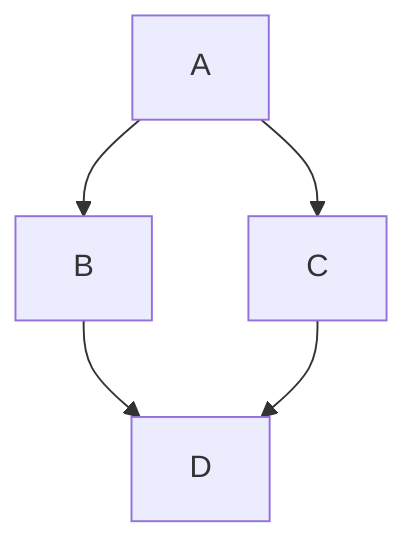

# GitHub Cheat Sheet

A collection of cool hidden and not so hidden features of Git and GitHub.

## Table of Contents

- [GitHub](#github)
  - [Ignore Whitespace in Diffs](#ignore-whitespace-in-diffs)
  - [Adjust Tab Space](#adjust-tab-space)
  - [Commit History by Author](#commit-history-by-author)
  - [Cloning a Repository](#cloning-a-repository)
  - [Branches](#branches)
    - [Compare all Branches to Another Branch](#compare-all-branches-to-another-branch)
    - [Comparing Branches](#comparing-branches)
    - [Compare Branches across Forked Repositories](#compare-branches-across-forked-repositories)
  - [Gists](#gists)
  - [Git.io URL Shortener](#gitio-url-shortener)
  - [Keyboard Shortcuts](#keyboard-shortcuts)
  - [Line Highlighting in Repositories](#line-highlighting-in-repositories)
  - [Closing Issues via Commit Messages](#closing-issues-via-commit-messages)
  - [Cross-Link Issues](#cross-link-issues)
  - [Locking Conversations](#locking-conversations)
  - [CI Status on Pull Requests](#ci-status-on-pull-requests)
  - [Filters for Issues and PRs](#filters-for-issues-and-prs)
  - [Syntax Highlighting in Markdown Files](#syntax-highlighting-in-markdown-files)
  - [Emojis](#emojis)
  - [Images/GIFs](#imagesgifs)
    - [Embedding Images in GitHub Wiki](#embedding-images-in-github-wiki)
  - [Quick Quoting](#quick-quoting)
  - [Pasting Clipboard Image to Comments](#pasting-clipboard-image-to-comments)
  - [Quick Licensing](#quick-licensing)
  - [Task Lists](#task-lists)
    - [Task Lists in Markdown Documents](#task-lists-in-markdown-documents)
  - [Relative Links](#relative-links)
  - [Viewing YAML Metadata in your Documents](#viewing-yaml-metadata-in-your-documents)
  - [Rendering Tabular Data](#rendering-tabular-data)
  - [Rendering PDFs](#rendering-pdfs)
  - [Revert a Pull Request](#revert-a-pull-request)
  - [Diffs](#diffs)
    - [Rendered Prose Diffs](#rendered-prose-diffs)
    - [Diffable Maps](#diffable-maps)
    - [Expanding Context in Diffs](#expanding-context-in-diffs)
    - [Diff or Patch of Pull Request](#diff-or-patch-of-pull-request)
    - [Rendering and Diffing Images](#rendering-and-diffing-images)
  - [Contribution Guidelines](#contribution-guidelines)
    - [CONTRIBUTING File](#contributing-file)
    - [ISSUE_TEMPLATE File](#issue_template-file)
    - [PULL_REQUEST_TEMPLATE File](#pull_request_template-file)
  - [Octicons](#octicons)
  - [GitHub Student Developer Pack](#github-student-developer-pack)
  - [SSH Keys](#ssh-keys)
  - [Profile Image](#profile-image)
  - [Repository Templates](#repository-templates)
  - [GitHub Codespaces](#github-codespaces)
  - [GitHub Actions](#github-actions)
  - [Dependabot](#dependabot)
  - [GitHub Discussions](#github-discussions)
  - [Code Owners](#code-owners)
  - [Protecting Branches](#protecting-branches)
  - [GitHub Pages](#github-pages)
  - [GitHub Copilot](#github-copilot)
  - [GitHub Sponsors](#github-sponsors)
  - [Saved Replies](#saved-replies)
  - [Markdown Footnotes](#markdown-footnotes)
  - [Alerts in Markdown](#alerts-in-markdown)
  - [Mermaid Diagrams](#mermaid-diagrams)
  - [GeoJSON and TopoJSON Maps](#geojson-and-topojson-maps)
  - [STL 3D Models](#stl-3d-models)
  - [GitHub CLI (gh)](#github-cli-gh)
  - [GitHub Mobile](#github-mobile)
  - [Pin Repositories to Profile](#pin-repositories-to-profile)
  - [Profile README](#profile-readme)
  - [GitHub Archive Program](#github-archive-program)
- [Git](#git)
  - [Remove All Deleted Files from the Working Tree](#remove-all-deleted-files-from-the-working-tree)
  - [Previous Branch](#previous-branch)
  - [Stripspace](#stripspace)
  - [Checking out Pull Requests](#checking-out-pull-requests)
  - [Empty Commits](#empty-commits)
  - [Styled Git Status](#styled-git-status)
  - [Styled Git Log](#styled-git-log)
  - [Git Query](#git-query)
  - [Git Grep](#git-grep)
  - [Merged Branches](#merged-branches)
  - [Fixup and Autosquash](#fixup-and-autosquash)
  - [Web Server for Browsing Local Repositories](#web-server-for-browsing-local-repositories)
  - [Git Bisect](#git-bisect)
  - [Git Stash](#git-stash)
  - [Git Rebase Interactive](#git-rebase-interactive)
  - [Git Cherry-Pick](#git-cherry-pick)
  - [Git Reflog](#git-reflog)
  - [Git Worktree](#git-worktree)
  - [Git Blame](#git-blame)
  - [Git Submodules](#git-submodules)
  - [Git Aliases](#git-aliases)
  - [Auto-Correct](#auto-correct)
  - [Git Configuration Color](#git-configuration-color)
  - [Git Shortlog](#git-shortlog)
  - [Git Archive](#git-archive)
  - [Git Clean](#git-clean)
  - [Git Diff with Word Highlighting](#git-diff-with-word-highlighting)
  - [Git Partial Clone](#git-partial-clone)
  - [Git Sparse Checkout](#git-sparse-checkout)
- [Resources](#resources)

---

## GitHub

### Ignore Whitespace in Diffs

Adding `?w=1` to any diff URL will remove any changes only in whitespace, enabling you to see only the code that has changed.

```
https://github.com/user/repo/pull/1/files?w=1
```


### Adjust Tab Space

Adding `?ts=4` to a diff or file URL will display tab characters as 4 spaces wide instead of the default 8. The number after `ts` can be adjusted to suit your preference.

Here is a Go source file before adding `?ts=4`:


...and this is after adding `?ts=4`:


### Commit History by Author

To view all commits on a repo by author add `?author={user}` to the URL.

```
https://github.com/rails/rails/commits/master?author=dhh
```


### Cloning a Repository

When cloning a repository the `.git` can be left off the end.

```bash
git clone https://github.com/user/repo
```

### Branches

#### Compare all Branches to Another Branch

If you go to the repo's Branches page:

```
https://github.com/{user}/{repo}/branches
```

...you would see a list of all branches which are not merged into the main branch.


#### Comparing Branches

To use GitHub to compare branches, change the URL to look like this:

```
https://github.com/{user}/{repo}/compare/{range}
```

where `{range} = master...4-1-stable`

For example:

```
https://github.com/rails/rails/compare/master...4-1-stable
```


`{range}` can be changed to things like:

```
https://github.com/rails/rails/compare/master@{1.day.ago}...master
https://github.com/rails/rails/compare/master@{2014-10-04}...master
```

*Here, dates are in the format `YYYY-MM-DD`*


Branches can also be compared in `diff` and `patch` views:

```
https://github.com/rails/rails/compare/master...4-1-stable.diff
https://github.com/rails/rails/compare/master...4-1-stable.patch
```

#### Compare Branches across Forked Repositories

To use GitHub to compare branches across forked repositories:

```
https://github.com/{user}/{repo}/compare/{foreign-user}:{branch}...{own-branch}
```

For example:

```
https://github.com/rails/rails/compare/byroot:master...master
```


### Gists

[Gists](https://gist.github.com/) are an easy way to work with small bits of code without creating a fully fledged repository.


Add `.pibb` to the end of any Gist URL in order to get the *HTML-only* version suitable for embedding.

Gists can be treated as a repository so they can be cloned like any other:

```bash
git clone https://gist.github.com/gist-id
```

### Git.io URL Shortener

[Git.io](http://git.io) is a simple URL shortener for GitHub.


You can also use it via pure HTTP using Curl:

```bash
curl -i http://git.io -F "url=https://github.com/..."
```

### Keyboard Shortcuts

When on a repository page, keyboard shortcuts allow you to navigate easily.

- Pressing `t` will bring up a file explorer.
- Pressing `w` will bring up the branch selector.
- Pressing `s` will focus the search field for the current repository.
- Pressing `l` will edit labels on existing Issues.
- Pressing `y` **when looking at a file** will freeze the page you are looking at.

To see all of the shortcuts for the current page press `?`:


### Line Highlighting in Repositories

Either adding, e.g., `#L52` to the end of a code file URL or simply clicking the line number will highlight that line number.

It also works with ranges, e.g., `#L53-L60`, to select ranges, hold `shift` and click two lines:

```
https://github.com/rails/rails/blob/master/activemodel/lib/active_model.rb#L53-L60
```


### Closing Issues via Commit Messages

If a particular commit fixes an issue, any of the keywords `fix/fixes/fixed`, `close/closes/closed` or `resolve/resolves/resolved`, followed by the issue number, will close the issue once it is committed to the repository's default branch.

```bash
git commit -m "Fix screwup, fixes #12"
```

This closes the issue and references the closing commit.


### Cross-Link Issues

If you want to link to another issue in the same repository, simply type hash `#` then the issue number, and it will be auto-linked.

To link to an issue in another repository, `{user}/{repo}#ISSUE_NUMBER`, e.g., `tiimgreen/toc#12`.


### Locking Conversations

Pull Requests and Issues can now be locked by owners or collaborators of the repo.


This means that users who are not collaborators on the project will no longer be able to comment.


### CI Status on Pull Requests

If set up correctly, every time you receive a Pull Request, CI services will build that Pull Request just like it would every time you make a new commit.

[](https://github.com/octokit/octokit.rb/pull/452)

### Filters for Issues and PRs

Both issues and pull requests allow filtering in the user interface.

For the Rails repo: `is:issue label:activerecord`

But, you can also find all issues that are NOT labeled activerecord:

`is:issue -label:activerecord`

Additionally, this also works for pull requests:

`is:pr -label:activerecord`

Github has tabs for displaying open or closed issues and pull requests but you can also see merged pull requests. Just put the following in the filter:

`is:merged`

Finally, github now allows you to filter by the Status API's status:

`status:success`

### Syntax Highlighting in Markdown Files

For example, to syntax highlight Ruby code in your Markdown files write:

````markdown
```ruby
require 'tabbit'
table = Tabbit.new('Name', 'Email')
table.add_row('Tim Green', 'tiimgreen@gmail.com')
puts table.to_s
```
````

GitHub uses [Linguist](https://github.com/github/linguist) to perform language detection and syntax highlighting.

### Emojis

Emojis can be added to Pull Requests, Issues, commit messages, repository descriptions, etc. using `:name_of_emoji:`.

The top 5 used Emojis on GitHub are:

1. `:shipit:`
2. `:sparkles:`
3. `:-1:`
4. `:+1:`
5. `:clap:`

### Images/GIFs

Images and GIFs can be added to comments, READMEs etc.:

```

```


All images are cached on GitHub, so if your host goes down, the image will remain available.

#### Embedding Images in GitHub Wiki

There are multiple ways of embedding images in Wiki pages. There's also a syntax that allows things like specifying the height or width of the image:

```markdown
[[ http://www.sheawong.com/wp-content/uploads/2013/08/keephatin.gif | height = 100px ]]
```

Which produces:


### Quick Quoting

When on a comment thread and you want to quote something someone previously said, highlight the text and press `r`, this will copy it into your text box in the block-quote format.


### Pasting Clipboard Image to Comments

After taking a screenshot and adding it to the clipboard, you can simply paste (`cmd-v / ctrl-v`) the image into the comment section and it will be auto-uploaded to github.


### Quick Licensing

When creating a repository, GitHub gives you the option of adding in a pre-made license:


You can also add them to existing repositories by creating a new file through the web interface. When the name `LICENSE` is typed in you will get an option to use a template:


### Task Lists

In Issues and Pull requests check boxes can be added with the following syntax (notice the space):

```
- [ ] Be awesome
- [ ] Prepare dinner
  - [ ] Research recipe
  - [ ] Buy ingredients
  - [ ] Cook recipe
- [ ] Sleep
```


When they are clicked, they will be updated in the pure Markdown:

```
- [x] Be awesome
- [ ] Prepare dinner
  - [x] Research recipe
  - [x] Buy ingredients
  - [ ] Cook recipe
- [ ] Sleep
```

#### Task Lists in Markdown Documents

In full Markdown documents **read-only** checklists can now be added:

```
- [ ] Mercury
- [x] Venus
- [x] Earth
  - [x] Moon
- [x] Mars
  - [ ] Deimos
  - [ ] Phobos
```

- [ ] Mercury
- [x] Venus
- [x] Earth
  - [x] Moon
- [x] Mars
  - [ ] Deimos
  - [ ] Phobos

### Relative Links

Relative links are recommended in your Markdown files when linking to internal content.

```markdown
[Link to a header](#awesome-section)
[Link to a file](docs/readme)
```

Absolute links have to be updated whenever the URL changes. Using relative links makes your documentation easily stand on its own.

### Viewing YAML Metadata in your Documents

Many blogging websites, like Jekyll with GitHub Pages, depend on some YAML-formatted metadata at the beginning of your post. GitHub will render this metadata as a horizontal table, for easier reading.


### Rendering Tabular Data

GitHub supports rendering tabular data in the form of `.csv` (comma-separated) and `.tsv` (tab-separated) files.


### Rendering PDFs

GitHub supports rendering PDF:


### Revert a Pull Request

After a pull request is merged, you may find it does not help anything or it was a bad decision to merge.

You can revert it by clicking the **Revert** button on the right side of a commit in the pull request page.


### Diffs

#### Rendered Prose Diffs

Commits and pull requests, including rendered documents supported by GitHub (e.g., Markdown), feature *source* and *rendered* views.


Click the "rendered" button to see the changes as they'll appear in the rendered document.


#### Diffable Maps

Any time you view a commit or pull request on GitHub that includes geodata, GitHub will render a visual representation of what was changed.

[](https://github.com/benbalter/congressional-districts/commit/2233c76ca5bb059582d796f053775d8859198ec5)

#### Expanding Context in Diffs

Using the *unfold* button in the gutter of a diff, you can reveal additional lines of context with a click.


#### Diff or Patch of Pull Request

You can get the diff of a Pull Request by adding a `.diff` or `.patch` extension to the end of the URL. For example:

```
https://github.com/tiimgreen/github-cheat-sheet/pull/15
https://github.com/tiimgreen/github-cheat-sheet/pull/15.diff
https://github.com/tiimgreen/github-cheat-sheet/pull/15.patch
```

#### Rendering and Diffing Images

GitHub can display several common image formats, including PNG, JPG, GIF, and PSD. In addition, there are several ways to compare differences between versions of those image formats.

[](https://github.com/blog/1845-psd-viewing-diffing)

### Contribution Guidelines

GitHub supports adding 3 different files which help users contribute to your project.

#### CONTRIBUTING File

Adding a `CONTRIBUTING` or `CONTRIBUTING.md` file will add a link to your file when a contributor creates an Issue or opens a Pull Request.


#### ISSUE_TEMPLATE File

You can define a template for all new issues opened in your project. The content of this file will pre-populate the new issue box.


#### PULL_REQUEST_TEMPLATE File

You can define a template for all new pull requests opened in your project. The content of this file will pre-populate the text area when users create pull requests.

### Octicons

GitHub's icons (Octicons) have now been open sourced.


### GitHub Student Developer Pack

If you are a student you will be eligible for the GitHub Student Developer Pack. This gives you free credit, free trials and early access to software.


### SSH Keys

You can get a list of public ssh keys in plain text format by visiting:

```
https://github.com/{user}.keys
```

### Profile Image

You can get a user's profile image by visiting:

```
https://github.com/{user}.png
```

### Repository Templates

You can enable templating on your repository which allows anyone to copy the directory structure and files.


Changing to a template repository will give a new URL endpoint which can be shared and instantly allows users to use your repository as a template.


### GitHub Codespaces

Spin up a cloud-hosted VS Code environment instantly from any repository. Accessible via the **Code** button.

### GitHub Actions

Automate workflows with CI/CD pipelines. Define workflows in `.github/workflows/`:

```yaml
name: CI
on: [push]
jobs:
  build:
    runs-on: ubuntu-latest
    steps:
      - uses: actions/checkout@v4
      - run: npm test
```

### Dependabot

Automatically detect and update outdated dependencies. Enable in Settings or add `.github/dependabot.yml`:

```yaml
version: 2
updates:
  - package-ecosystem: "npm"
    directory: "/"
    schedule:
      interval: "weekly"
```

### GitHub Discussions

Enable community discussions separate from issues. Great for Q&A, show-and-tell, and general conversation.

### Code Owners

Define a `CODEOWNERS` file to automatically assign reviewers for specific files or directories:

```
# CODEOWNERS
*.js       @frontend-team
/docs/     @docs-team
```

### Protecting Branches

Require reviews, status checks, and signed commits before merging into important branches like `main`.

### GitHub Pages

Host static websites directly from your repository. Enable in Settings → Pages.

### GitHub Copilot

AI-powered code completion and chat assistant built into the GitHub ecosystem.

### GitHub Sponsors

Support open-source maintainers directly through GitHub's sponsorship program.

### Saved Replies

Save frequently used responses for Issues and PRs. Access via the saved replies button in the comment toolbar.

### Markdown Footnotes

Add footnotes in GitHub Flavored Markdown:

```markdown
Here's a sentence with a footnote.[^1]

[^1]: This is the footnote.
```

### Alerts in Markdown

Create styled callout boxes:

```markdown
> [!NOTE]
> Useful information for users.

> [!WARNING]
> Important warning message.

> [!TIP]
> Helpful tip or best practice.
```

### Mermaid Diagrams

Render diagrams from text using Mermaid syntax:

````markdown

````

### GeoJSON and TopoJSON Maps

GitHub renders `.geojson` and `.topojson` files as interactive maps.

### STL 3D Models

View and interact with 3D models in `.stl` files directly in the browser.

### GitHub CLI (gh)

GitHub's official command-line tool:

```bash
gh repo create
gh pr create
gh issue list
gh run view
```

### GitHub Mobile

Manage repositories, review code, and merge PRs from iOS and Android devices.

### Pin Repositories to Profile

Pin up to 6 repositories to your GitHub profile for easy access.

### Profile README

Create a repository matching your username to display a special README on your profile page.

### GitHub Archive Program

Your code is preserved in the Arctic World Archive for future generations.

---

## Git

### Remove All Deleted Files from the Working Tree

When you delete a lot of files using `/bin/rm` you can use the following command to remove them from the working tree and from the index:

```bash
git rm $(git ls-files -d)
```

For example:

```bash
git status
# On branch master
# Changes not staged for commit:
#   deleted:    a
#   deleted:    c

git rm $(git ls-files -d)
# rm 'a'
# rm 'c'
```

### Previous Branch

To move to the previous branch in Git:

```bash
git checkout -
# Switched to branch 'master'

git checkout -
# Switched to branch 'next'
```

### Stripspace

Git Stripspace:

- Strips trailing whitespace
- Collapses newlines
- Adds newline to end of file

```bash
git stripspace < README.md
```

### Checking out Pull Requests

Pull Requests are special branches on the GitHub repository which can be retrieved locally:

```bash
git fetch origin refs/pull/[PR-Number]/head
```

Acquire all Pull Request branches as local remote branches by refspec:

```bash
git fetch origin '+refs/pull/*/head:refs/remotes/origin/pr/*'
```

Or configure your `.git/config` to fetch Pull Requests automatically:

```ini
[remote "origin"]
    fetch = +refs/heads/*:refs/remotes/origin/*
    url = git@github.com:user/repo.git
    fetch = +refs/pull/*/head:refs/remotes/origin/pr/*
```

### Empty Commits

Commits can be pushed with no code changes by adding `--allow-empty`:

```bash
git commit -m "Big-ass commit" --allow-empty
```

Useful for:

- Annotating the start of a new bulk of work or a new feature.
- Documenting when you make changes to the project that aren't code related.
- Communicating with people using your repository.
- The first commit of a repository: `git commit -m "Initial commit" --allow-empty`.

### Styled Git Status

Running:

```bash
git status
```

produces:


By adding `-sb`:

```bash
git status -sb
```

this is produced:


### Styled Git Log

Running:

```bash
git log --all --graph --pretty=format:'%Cred%h%Creset -%C(auto)%d%Creset %s %Cgreen(%cr) %C(bold blue)<%an>%Creset' --abbrev-commit --date=relative
```

produces:


### Git Query

A Git query allows you to search all your previous commit messages and find the most recent one matching the query.

```bash
git show :/query
```

where `query` (case-sensitive) is the term you want to search:

```bash
git show :/typo
```


*Press `q` to quit.*

### Git Grep

Git Grep will return a list of lines matching a pattern.

```bash
git grep aliases
```

will show all the files containing the string *aliases*.


*Press `q` to quit.*

You can also use multiple flags for more advanced search:

- `-e` The next parameter is the pattern (e.g., regex)
- `--and`, `--or` and `--not` Combine multiple patterns.

```bash
git grep -e pattern --and -e anotherpattern
```

### Merged Branches

Running:

```bash
git branch --merged
```

will give you a list of all branches that have been merged into your current branch.

Conversely:

```bash
git branch --no-merged
```

will give you a list of branches that have not been merged.

### Fixup and Autosquash

If there is something wrong with a previous commit, for example `abcde`:

```bash
git commit --fixup=abcde
git rebase abcde^ --autosquash -i
```

### Web Server for Browsing Local Repositories

Use the Git `instaweb` command to instantly browse your working repository in `gitweb`.

```bash
git instaweb
```

opens:


### Git Bisect

Find the commit that introduced a bug using binary search:

```bash
git bisect start
git bisect bad              # current commit is bad
git bisect good abc1234     # this commit was good
# Git checks out a middle commit — test it, then:
git bisect good             # or git bisect bad
# Repeat until the offending commit is found
git bisect reset            # clean up
```

### Git Stash

Temporarily save uncommitted changes:

```bash
git stash                   # stash current changes
git stash list              # list all stashes
git stash pop               # restore and remove latest stash
git stash apply stash@{2}   # restore a specific stash
git stash drop stash@{1}    # delete a specific stash
```

### Git Rebase Interactive

Rewrite commit history interactively:

```bash
git rebase -i HEAD~5
```

Options include: `pick`, `reword`, `edit`, `squash`, `fixup`, `drop`.

### Git Cherry-Pick

Apply a specific commit to the current branch:

```bash
git cherry-pick abc1234
```

### Git Reflog

Recover lost commits and branches:

```bash
git reflog                  # show all HEAD positions
git reset --hard HEAD@{3}   # restore to a previous state
```

### Git Worktree

Work on multiple branches simultaneously:

```bash
git worktree add ../feature-branch feature-branch
git worktree list           # list all worktrees
git worktree remove ../feature-branch
```

### Git Blame

See who last modified each line:

```bash
git blame file.py
git blame -L 10,20 file.py  # blame a specific range
```

### Git Submodules

Include other repositories within your project:

```bash
git submodule add https://github.com/user/lib.git
git submodule update --init --recursive
```

### Git Aliases

Create shortcuts in `~/.gitconfig`:

```ini
[alias]
    co = checkout
    br = branch
    st = status -sb
    lg = log --oneline --graph --decorate
    ac = !git add -A && git commit -m
    undo = reset --soft HEAD~1
    cleanup = "!git branch --merged | grep -v '\\*' | xargs git branch -d"
```

Some useful aliases:

| Alias | Command | What to Type |
| --- | --- | --- |
| `git cm` | `git commit` | `git config --global alias.cm commit` |
| `git co` | `git checkout` | `git config --global alias.co checkout` |
| `git ac` | `git add . -A` `git commit` | `git config --global alias.ac '!git add -A && git commit'` |
| `git st` | `git status -sb` | `git config --global alias.st 'status -sb'` |
| `git tags` | `git tag -l` | `git config --global alias.tags 'tag -l'` |
| `git branches` | `git branch -a` | `git config --global alias.branches 'branch -a'` |
| `git cleanup` | clean up merged branches | `git config --global alias.cleanup "!git branch --merged \| grep -v '*' \| xargs git branch -d"` |
| `git remotes` | `git remote -v` | `git config --global alias.remotes 'remote -v'` |

### Auto-Correct

Git gives suggestions for misspelled commands. Auto-correct can be enabled like this (with a 1.5 second delay):

```bash
git config --global help.autocorrect 15
```

So now the command `git comit` will be auto-corrected to `git commit`:

```
WARNING: You called a Git command named 'comit', which does not exist.
Continuing under the assumption that you meant 'commit'
in 1.5 seconds automatically...
```

### Git Configuration Color

To add more color to your Git output:

```bash
git config --global color.ui 1
```

### Git Shortlog

Get a summary of commits per author:

```bash
git shortlog -sn            # sorted by number of commits
git shortlog -sn --no-merges # exclude merge commits
```

### Git Archive

Create a zip/tar of your repo without `.git` directory:

```bash
git archive --format=zip -o project.zip HEAD
git archive --format=tar main | gzip > project.tar.gz
```

### Git Clean

Remove untracked files:

```bash
git clean -n                # dry run
git clean -f                # remove untracked files
git clean -fd               # remove untracked files and directories
git clean -fX               # remove only ignored files
```

### Git Diff with Word Highlighting

See word-level changes within lines:

```bash
git diff --word-diff
git diff --word-diff=color  # colored word diff
```

### Git Partial Clone

Clone without downloading all blobs (useful for large repos):

```bash
git clone --filter=blob:none https://github.com/user/large-repo.git
```

### Git Sparse Checkout

Checkout only specific directories:

```bash
git clone --sparse https://github.com/user/repo.git
cd repo
git sparse-checkout add docs/ src/utils/
```

---

## Resources

| Resource | Link |
| --- | --- |
| GitHub Docs | https://docs.github.com |
| GitHub Blog | https://github.blog |
| GitHub Explore | https://github.com/explore |
| GitHub Training | https://training.github.com |
| GitHub Community | https://github.community |
| Git Official Site | https://git-scm.com |
| Pro Git Book | https://git-scm.com/book/en/v2 |
| Learn Git Branching | https://learngitbranching.js.org |
| Git Ignore Templates | https://github.com/github/gitignore |
| GitHub CLI | https://cli.github.com |
| GitHub Status | https://www.githubstatus.com |
| GitHub Changelog | https://github.blog/changelog |
